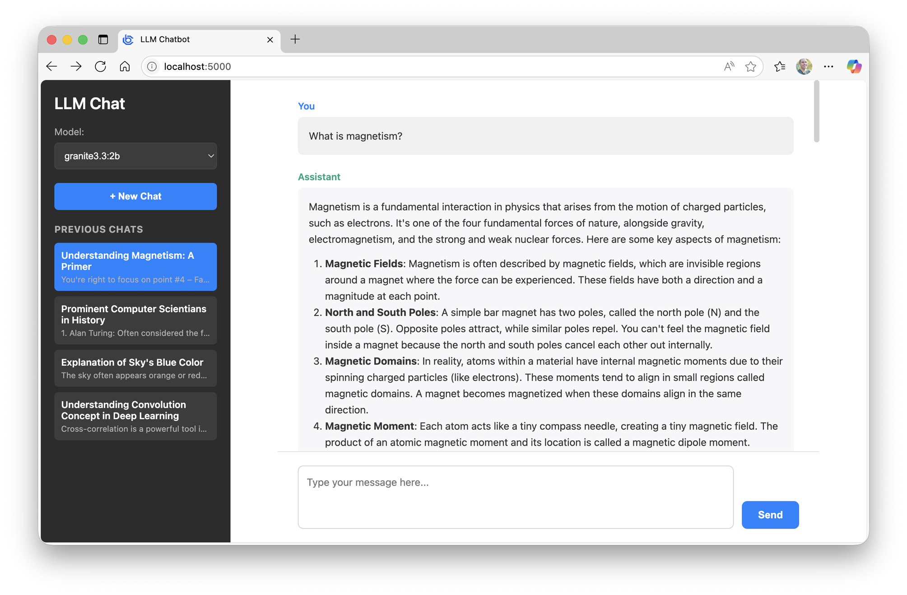
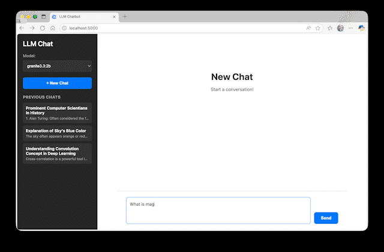
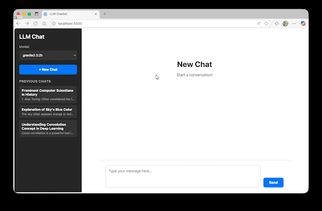
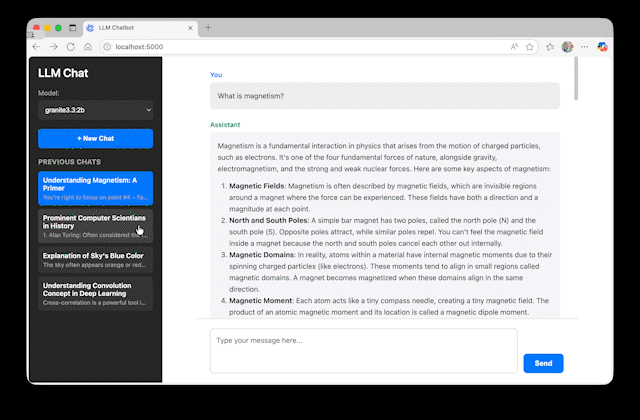

# LLM Chatbot Web UI

> Minimal, Python-only chat interface for local Ollama models. No Node.js. No build tooling. Just Flask + vanilla JS.



<p align="center">
  <a href="https://www.python.org"></a>
  <a href="https://flask.palletsprojects.com"></a>
  <a href="LICENSE"></a>
  
</p>

---

## Table of Contents
1. [Overview](#overview)  
2. [Features](#features)  
3. [Prerequisites](#prerequisites)  
4. [Installation](#installation)  
5. [Quick Start](#quick-start)  
6. [Usage](#usage)  
7. [Configuration](#configuration)  
8. [API](#api-endpoints)  
9. [Project Structure](#project-structure)  
10. [Troubleshooting](#troubleshooting)  
11. [Roadmap](#roadmap)  
12. [License](#license)

---

## Overview
A clean, mobile-inspired chat UI to interact with models served by [Ollama](https://ollama.ai/). It focuses on frictionless setup: clone, install Python deps, run Flask, chat.

---

## Features

| Category | Description |
|----------|-------------|
| 💬 Chat Interface | Simple two-column layout with markdown-rendered model replies |
| 🤖 Local Models | Uses any model already pulled into your Ollama install |
| 🎯 Model Picker | Dynamic dropdown of locally available models |
| 🔁 Context | Sends last 3 messages each turn for coherent multi-turn dialogue |
| 📝 Auto Titles | First user prompt triggers a lightweight title generation request |
| 📚 History | Chats persisted in browser localStorage; reload and revisit anytime |
| 🧾 Markdown | Supports code blocks, tables, lists via client-side rendering |
| 🪄 Zero Build | No bundlers, transpilers, or Node dependencies |
| 📱 Responsive | Feels like a compact mobile chat on wider screens |

### Chat Flow
The core experience: a clean conversation stream showing your prompts and the model's markdown-formatted replies. Messages auto-scroll, code blocks, lists, and tables render seamlessly for readability.



### Model Selection
Choose any locally available Ollama model on the fly. The dropdown is populated from the `/api/v1/models` endpoint so newly pulled models appear after a refresh. Switching models immediately affects subsequent prompts—no restart required.



### Conversation Context
Each new prompt sends the last three prior messages (user/assistant) to preserve short-term conversational grounding. This keeps responses relevant without heavy memory or manual summarization.


### Previous Chats
Every conversation is stored locally in your browser. Start a new chat to archive the current one, then revisit any past session instantly. Titles are auto-generated from the initial prompt for quick scanning.



---

## Prerequisites
- Python 3.12+  
- Ollama installed & running (`ollama serve`)  
- At least one model pulled (e.g. `ollama pull llama2`)  
- Optional: [uv](https://github.com/astral-sh/uv) for fast dependency management  

Install Ollama: https://ollama.ai/download

---

## Installation

### Option A: uv (Recommended)
```bash
curl -LsSf https://astral.sh/uv/install.sh | sh        # macOS/Linux
# Windows (PowerShell):
powershell -c "irm https://astral.sh/uv/install.ps1 | iex"

git clone https://github.com/imraf/ollama-webui-llm.git
cd ollama-webui-llm
uv sync
uv run python server.py
```

### Option B: pip / venv
```bash
git clone https://github.com/imraf/ollama-webui-llm.git
cd ollama-webui-llm

python3 -m venv venv
source venv/bin/activate            # macOS/Linux
# venv\Scripts\activate             # Windows

pip install -r requirements.txt
python server.py
```

---

## Quick Start
1. Pull a model: `ollama pull llama2`
2. Run Ollama: `ollama serve` (if not auto-started)
3. Start web UI: `python server.py`
4. Visit: http://localhost:5000

---

## Usage
1. Select a model in the left sidebar.
2. Type a prompt and send.
3. First prompt also triggers an automatic title request.
4. Click “New Chat” to archive the current conversation.
5. Load any previous chat from the history list.

---

## Configuration
Environment variables:
```bash
PORT=8080 python server.py     # Change port
DEBUG=False python server.py   # Disable debug
```
Ollama host (implicit): `http://localhost:11434`

---

## API Endpoints

### POST /api/v1/response
Send a prompt with optional short context (last 3 messages).
```json
{
  "prompt": "Explain attention mechanisms.",
  "model": "llama2",
  "context": [
    {"role": "user", "content": "Hi"},
    {"role": "assistant", "content": "Hello! How can I help?"}
  ]
}
```
Response:
```json
{
  "response": "Detailed explanation...",
  "model": "llama2"
}
```

### GET /api/v1/models
List models available locally.
Response:
```json
{
  "models": ["llama2", "granite3.3:2b"],
  "count": 2
}
```

---

## Project Structure
```
ollama-webui-llm/
├── server.py                # Flask server & endpoints
├── static/
│   ├── index.html           # UI layout
│   ├── style.css            # Minimal styling
│   └── app.js               # Client logic (chat, models, storage)
├── readme-media/            # Screenshots & animated GIFs
├── LICENSE                  # MIT License
└── README.md                # Documentation
```

---

## Troubleshooting

| Issue | Checks |
|-------|--------|
| Empty model list | `ollama list` — ensure models pulled |
| Connection errors | Is `ollama serve` running? Port 11434 reachable? |
| 404 static files | Run from project root; Flask static folder intact |
| Port conflict | Change with `PORT=7000 python server.py` |

---

## Roadmap
- [ ] Streaming responses  
- [ ] Export chat as JSON/Markdown  
- [ ] Optional system prompt injection  
- [ ] Simple theming (dark/light toggle)  

---

## License
MIT License. See [LICENSE](LICENSE).

---

## Acknowledgments
- Flask for backend simplicity  
- Ollama for local model serving  

---

### Tags
ollama llm chatbot flask python ai chat-ui local-llm